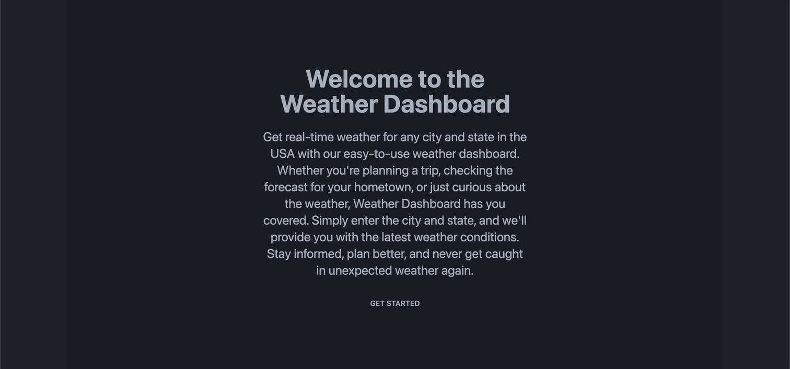

<link rel="stylesheet" href="https://cdn.jsdelivr.net/gh/devicons/devicon@v2.15.1/devicon.min.css">

          
          
# Weather Dashboard v2.0 

## Description
Weather Dashboard 2.0 is a simple yet powerful web application that allows users to retrieve up-to-the-minute weather information for any location within the United States. Designed for ease of use, it provides accurate weather data to help users plan their activities, stay informed, and make weather-related decisions.

## Quick Links

- [Installation](#installation)
  
- [Usage](#usage)

- [Technologies](#technologies)

- [Demo](#demo)
  
- [Contributors](#contributors)
  
- [Feedback and Support](#feedback-and-support)
  
- [License](#license)

## Installation

No install required for the web-based version. To run the application locally, clone the repository to your local machine

## Usage

To use the web-based version simply navigate to the deployed application [URL](https://weather-app-v2-0-92h91djsl-adam-brannons-projects.vercel.app/) and begin using the app in your browser.

## Technologies

          

## Demo

Follow me to the [Deployed Application](https://weather-app-v2-0-92h91djsl-adam-brannons-projects.vercel.app/)

## Contributors
Adam Brannon

[Check me out on Github](https://github.com/adam-brannon09)

[Email Me](mailto:adam.brannon09@icloud.com)

## Feedback and Support

If you encounter any issues while viewing Weather Dashboard v2.0 or have any suggestions for improvement, please [open an issue](https://github.com/adam-brannon09/weather-app-v2.0/issues) on the GitHub repository. I appreciate your feedback and will address any concerns as soon as possible.

## License

Weather Dashboard v2.0 is released under the [MIT License](https://opensource.org/licenses/MIT). You are free to use, modify, and distribute this application as per the terms of this license.

    

